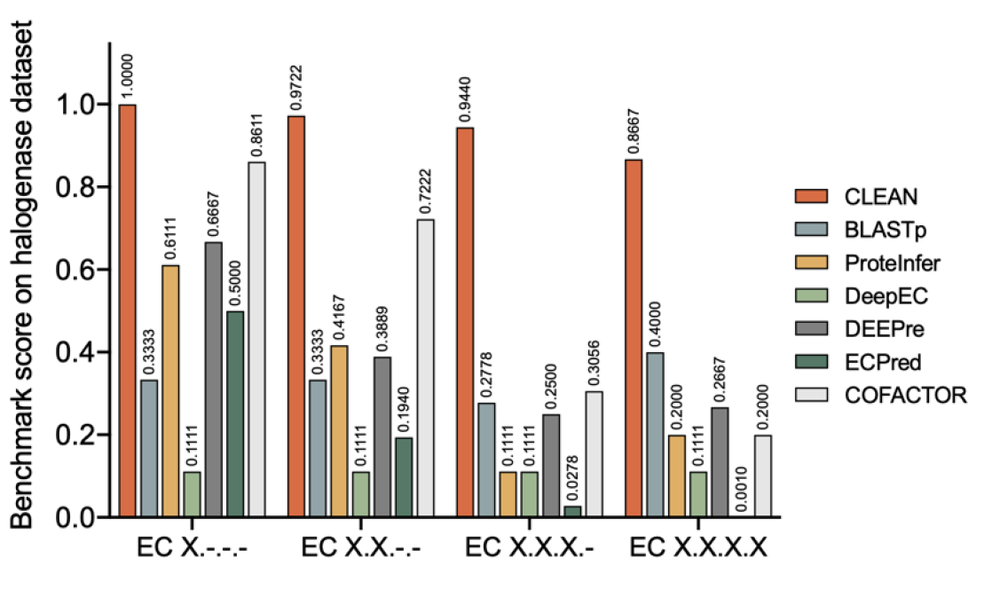

# CLEAN: Enzyme Function Prediction using Contrastive Learning

  

[](https://zenodo.org/badge/latestdoi/525112894)

CLEAN is converted into an easy-to-use webserver and made freely accessible at [MMLI tools](https://clean.frontend.mmli1.ncsa.illinois.edu/configuration).

  
This is the official repository for the paper [*Enzyme Function Prediction using Contrastive Learning*](https://www.science.org/doi/10.1126/science.adf2465). **CLEAN**, **Contrastive Learning enabled Enzyme ANnotation**, is a machine learning algorithm to assign Enzyme Commission (EC) number with better accuracy, reliability, and sensitivity than all existing computational tools. We also offer a [web server](https://clean.frontend.mmli1.ncsa.illinois.edu/configuration) for CLEAN as part of MMLI AlphaSynthesis tools. Please note that as an initial release, CLEAN web server uses default parameters to generate results. In the future, we will allow user customized parameters. In the meantime, to reproduce the results in our manuscript, please follow the following guide.

To use CLEAN to inference the EC number for any amino acid sequence, we included the pretrained weights for both the 70% and 100% identity clustering split of SwissProt (expertly reviewed portion of the UniProt, total ~220k training data). User can follow the instruction below on how to install and inference with CLEAN. We also provide full training scripts.

<p  align="center">



</p>


If you find CLEAN helpful in your research, please consider citing us:

    @article{doi:10.1126/science.adf2465,
      author = {Tianhao Yu  and Haiyang Cui  and Jianan Canal Li  and Yunan Luo  and Guangde Jiang  and Huimin Zhao },
      title = {Enzyme function prediction using contrastive learning},
      journal = {Science},
      volume = {379},
      number = {6639},
      pages = {1358-1363},
      year = {2023},
      doi = {10.1126/science.adf2465},
      URL = {https://www.science.org/doi/abs/10.1126/science.adf2465}
    }  


## 1. Install

### 1.1 Requirements

Python >= 3.6; PyTorch >= 1.11.0; CUDA >= 10.1
Manuscript result was obtained using Python 3.10.4; PyTorch 1.11.0; CUDA 11.3; fair-esm 1.0.2

  

### 1.2 Quickstart


```

cd CLEAN/app/
conda create -n clean python==3.10.4 -y
conda activate clean
pip install -r requirements.txt

```

Pytorch installation is different for different Operating systems, please refer [Pytorch Installation](https://pytorch.org/get-started/locally/).
For Linux, please use the following commands.

  

```

conda install pytorch==1.11.0 cpuonly -c pytorch (CPU)
conda install pytorch==1.11.0 cudatoolkit=11.3 -c pytorch (GPU)

```

  The input FASTA file should be present in the data/inputs directory. We have provided 2 input sample files already in the codebase - price.fasta and init.fasta. We have also included pretrained weights for 70% and 100% splits, along with pre-evaluated embeddings for each EC cluster centers for fastest inference. Download, unzip [these files](https://drive.google.com/file/d/1kwYd4VtzYuMvJMWXy6Vks91DSUAOcKpZ/view?usp=sharing) and move the contains to `data/pretrained`.

  Due to frequent requests, we are also releasing the train/test sets (5 folds for each of the split10/30/50/70/100) used in the paper. Please download from the [following link](https://drive.google.com/file/d/1MzYQ--CRK253eAKOmZrD1nzF-mXHfXtq/view?usp=sharing). As described in Supplementary Text 1. ML model development and evaluation, we are reporting results averaged across 5 folds, we didn't create additional validation sets, and interested users can create the validation sets following a similar procedure for creating train/test sets. Note that these cross-validation splits are from when developing CLEAN, and are not completely equal to the full split10/30/50/70/100 released in the repo. 


```

python build.py install
git clone https://github.com/facebookresearch/esm.git
mkdir data/esm_data
python CLEAN_infer_fasta.py --fasta_data price

```

  

result will be generated as `results/inputs/price_maxsep.csv`

  

### 1.2.1 Running in Docker (CPU version)

1. Pull the Docker Image for AMD64 Architecture Ubuntu Machine from moleculemaker/clean-image-amd64

```

docker pull moleculemaker/clean-image-amd64

```

***Our current experiments have only been successful on Docker Containers running with > 12GB Memory***

  

2. Running this library requires downloading huge weight files (around 7.3GB), so its better to pre-download the weight files and mount these while running the docker container. You can download these from:

```

curl -o esm1b_t33_650M_UR50S-contact-regression.pt https://dl.fbaipublicfiles.com/fair-esm/regression/esm1b_t33_650M_UR50S-contact-regression.pt

curl -o esm1b_t33_650M_UR50S.pt https://dl.fbaipublicfiles.com/fair-esm/models/esm1b_t33_650M_UR50S.pt

```

3. From the directory having these weight files, we are now ready to run the docker image. During this run, we will mount the above downloaded weights on the Docker container, start the container, and run the CLEAN library for a file price.fasta (which is already packaged in the image). If you wish to run this on your own FASTA file, you can copy it under /app/data/inputs directory. 

```

sudo docker run -it -v ./:/root/.cache/torch/hub/checkpoints moleculemaker/clean-image-amd64 /bin/bash -c 'echo Starting Execution && python $(pwd)/CLEAN_infer_fasta.py --fasta_data price'

```

The output file will be generated under results/inputs directory with the same name as the input file.   

### 1.3 Procedures

Install requirement and build CLEAN

```python

pip install -r requirements.txt
git clone https://github.com/facebookresearch/esm.git
python build.py install

```

Next, esm-1b embeddings need to be pre-computed from a FASTA file. There are two options:

1. Retrive all embedding for all SwissProt sequences (slow, but required for training)

2. Retrive only embeddings for enzymes to be inferenced (fast)

  

For option 1, run following commands in python:

```python

python

>>> from CLEAN.utils import *

>>> ensure_dirs("data/esm_data")

>>> ensure_dirs("data/pretrained")

>>> csv_to_fasta("data/split100.csv", "data/split100.fasta")

>>> retrive_esm1b_embedding("split100")

```

For option 2, move the fasta file (for example, `test.fasta`) to be inferred to `/data`, and run following commands :

```python

python

>>> from CLEAN.utils import *

>>> ensure_dirs("data/esm_data")

>>> ensure_dirs("data/pretrained")

>>> retrive_esm1b_embedding("test")

```

## 2. Inference

  

### 2.1 Preparation

  

We offer two EC-calling inference algorithms: `max-separation` and `p-value`. `max-separation` consistently gives better precision and recall, but results from `p-value` can be controlled by adjusting `p_value` as a hyperparameter.

  

Before inference, AA sequences to be inferred are stored in a CSV file, with the same format as the `split100.csv`. **The field `EC number` in the csv file can be any EC number if unknow, but please ignore the printed evaluation metrics in this case.** The esm-1b embeddings of the infered sequences need to be pre-computed using the following commands (using `new.csv` as an example):

```python

python

>>> from CLEAN.utils import *

>>> csv_to_fasta("data/new.csv", "data/new.fasta")

>>> retrive_esm1b_embedding("new")

```

#### 2.2.1 Inference with p-value

  

For inferencing using `p-value`, there are two hyperparameter: `nk_random` and `p_value`. `nk_random` is the number of randomly chosen enzymes (in thousands) from the training set used for calculating background distances (distances to incorrect EC numbers) for each EC number. `p-value` is the threshould for a EC number to be considered significant relative to the backgound distances. The following commands show how to get EC prediction results from `p-value`:

```python

python

>>> from CLEAN.infer import infer_pvalue

>>> train_data = "split100"

>>> test_data = "new"

>>> infer_pvalue(train_data, test_data, p_value=1e-5, nk_random=20,

report_metrics=True, pretrained=True)

```

This should produce similar results (depending on the version of ESM-1b weights):

```

The embedding sizes for train and test: torch.Size([241025, 128]) torch.Size([392, 128])

Calculating eval distance map, between 392 test ids and 5242 train EC cluster centers

############ EC calling results using random chosen 20k samples ############

---------------------------------------------------------------------------

>>> total samples: 392 | total ec: 177

>>> precision: 0.558 | recall: 0.477 | F1: 0.482 | AUC: 0.737

---------------------------------------------------------------------------

```

  

#### 2.2.2 Inference with max-separation

For inferencing using `max-separation`, there are no hyperparameters to tune: it's a greedy approach that prioritizes EC numbers that have the maximum separation to other EC numbers in terms of the pairwise distance to the query sequence. `max-separation` gives a deterministic prediction and usually outperforms `p-value` in turns of precision and recall. Because this algorithm does not need to sample from the training set, it is much faster than `p-value`. The following commands show how to get EC predicition results from `max-separation`:

```python

python

>>> from CLEAN.infer import infer_maxsep

>>> train_data = "split100"

>>> test_data = "new"

>>> infer_maxsep(train_data, test_data, report_metrics=True, pretrained=True)

```

This should produce similar results (depending on the version of ESM-1b weights):

```

The embedding sizes for train and test: torch.Size([241025, 128]) torch.Size([392, 128])

Calculating eval distance map, between 392 test ids and 5242 train EC cluster centers

############ EC calling results using maximum separation ############

---------------------------------------------------------------------------

>>> total samples: 392 | total ec: 177

>>> precision: 0.596 | recall: 0.479 | F1: 0.497 | AUC: 0.739

---------------------------------------------------------------------------

```

  

#### 2.2.3 Interpreting prediction result csv file

The prediction results are store in the folder `results/` with file name = test_data + infer_algo (for example, `new_maxsep.csv`). An example output would be:

```

Q9RYA6,EC:5.1.1.20/7.4553

O24527,EC:2.7.11.1/5.8561

Q5TZ07,EC:3.6.1.43/8.0610,EC:3.1.3.4/8.0627,EC:3.1.3.27/8.0728

```

Where the first column (`Q9RYA6`) is the id of the enzyme, second column (`EC:5.1.1.20/7.4553`) is the predicted EC number and pairwise distance between cluster center of `5.1.1.20` and `Q9RYA6`. Note in the case of enzyme `Q5TZ07`, three enzyme functions are predicted.

  
  
  

### 2.3 Inference with newly trained model

In addition to inferencing with pretrained weights for 70% and 100% splits, we also support inferencing with user-trained models. For example, if a model is trained and saved as `data/model/split10_triplet.pth`, inferencing with `max-separation`:

```python

from CLEAN.infer import *

infer_maxsep("split10", "new", report_metrics=True,

pretrained=False, model_name="split10_triplet")

```

  

### 2.4 Inference on a single FASTA file

In addition to inferencing a csv file with *Entry*, *EC number* and *Sequence*, we also allow inferencing on just a single FASTA file. For example, there is a simple FASTA file `data/query.fasta`:

```

>WP_063462990

LIDCNIDMTQLFAPSSSSTDATGAPQGLAKFPSLQGRAVFVTGGGSGIGAAIVAAFAE

QGARVAFVDVAREASEALAQHIADAGLPRPWWRVCDVRDVQALQACMADAAAELGSDF

AVLVNNVASDDRHTLESVTPEYYDERMAINERPAFFAIQAVVPGMRRLGAGSVINLGS

TGWQGKGTGYPCYAIAKSSVNGLTRGLAKTLGQDRIRINTVSPGWVMTERQIKLWLDA

EGEKELARNQCLPDKLRPHDIARMVLFLASDDAAMCTAQEFKVDAGWV

>WP_012434361

MSSPANANVRLADSAFARYPSLVDRTVLITGGATGIGASFVEHFAAQGARVAFFDIDA

SAGEALADELGDSKHKPLFLSCDLTDIDALQKAIADVKAALGPIQVLVNNAANDKRHT

IGEVTRESFDAGIAVNIRHQFFAAQAVMEDMKAANSGSIINLGSISWMLKNGGYPVYV

MSKSAVQGLTRGLARDLGHFNIRVNTLVPGWVMTEKQKRLWLDDAGRRSIKEGQCIDA

ELEPADLARMALFLAADDSRMITAQDIVVDGGWA

```

Inference through the following command in terminal:

```

python CLEAN_infer_fasta.py --fasta_data query

```

And the max-separation prediction will be stored in `results/query_maxsep.csv`.

  

## 3. Training

We provide the scripts for CLEAN models with both `triplet margin` and `Supcon-Hard` losses. Supcon-Hard Loss samples multiple positives and negatives and performs better than Triplet Margin Loss small training datasets, however it takes longer time to train.

`triplet margin` loss is given as:

  

$$  \mathcal{L}^{TM} = ||z_a - z_p||_2 - ||z_a - z_n||_2 + \alpha ,$$

  

where $z_a$ is the anchor, $z_p$ is the positive, $z_n$ is the hard-mined negative. `SupCon-Hard` loss is given as:

  

$$\mathcal{L}^{sup} = \sum_{e\in E} \frac{-1}{|P(e)|}\sum_{z_p \in P(e)}\log  \frac{\exp (z_e \cdot z_p / \tau)}{\sum_{z_a \in A(e)} \exp (z_i \cdot z_a / \tau) } $$

  

where a fixed number of positives are sampled from the same EC class as the anchor, and a fixed number of negatives are hard-mined.

Before training, a required step is to mutate the sequences with 'orphan' EC number ('orphan' in the way this EC number has only one sequence). Since we need to sample positive sequences other than the anchor sequence, we mutated the anchor sequence and use the mutated sequences as positive sequences. **This only needs to be done ONCE for every training file!**. Run following commands:  

```python

python

>>> from CLEAN.utils import mutate_single_seq_ECs, retrive_esm1b_embedding

>>> train_file = "split10"

>>> train_fasta_file = mutate_single_seq_ECs(train_file)

>>> retrive_esm1b_embedding(train_fasta_file)

```

Next, to speed up training, the pair-wise distance matrix and embedding matrix need to be pre-computed. **This only also only needs to be done ONCE for every training file!**. Run following commands:

```python

python

>>> from CLEAN.utils import compute_esm_distance

>>> train_file = "split10"

>>> compute_esm_distance(train_file)

```

This will save the two matrices (split10.pkl and split10_esm.pkl) in folder location `/data/distance_map`.

  

### 3.1 Train a CLEAN model with `triplet margin` loss

To train a CLEAN model with `triplet margin` loss, and take 10% split as an example, simply run:

```

python ./train-triplet.py --training_data split10 --model_name split10_triplet --epoch 2500

```

The model weight is saved as `/data/model/split10_triplet.pth` and to inference with it, see section 2.3.

  

We recommand different epoch numbers for training different splits:

- 10% split: epoch = 2000

- 30% split: epoch = 2500

- 50% split: epoch = 3500

- 70% split: epoch = 5000

- 100% split: epoch = 7000

  

### 3.2 Train a CLEAN model with `SupCon-Hard` loss

To train a CLEAN model with `SupCon-Hard` loss, and take 10% split as an example, run:

```

python ./train-supconH.py --training_data split10 --model_name split10_supconH --epoch 1500 --n_pos 9 --n_neg 30 -T 0.1

```

We fixed the number of positive to be 9, the number of positive to be 30 and temperature to be 0.1 in all of our experiments. We recommand using 25% less number of epochs compared to `triplet margin` loss on the same training data.

  

Also notice that the outputing embedding for `SupCon-Hard` is `out_dim=256` while for `triplet margin` is `out_dim=128`. To infer with a CLEAN-supconH model, see notes in `src/CLEAN/infer.py` about rebuilding CLEAN.

  

## 4. Confidence estimate using GMM

To train an ensumlbe of GMM:

```python

python gmm.py

```
